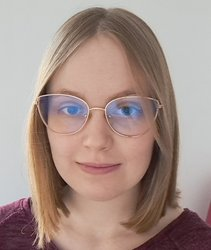

I'm a PhD student at the Faculty of Physics, University of Warsaw. I specialize in cloud microphysics. I work on numerical modelling of clouds, with the emphasis on mixed-phase processes.

I take part in the development of [UWLCM](https://github.com/igfuw/UWLCM "UWLCM"), as well as its dependency, the [libcloudph++](https://github.com/igfuw/libcloudphxx "libcloudph++") microphysics library.